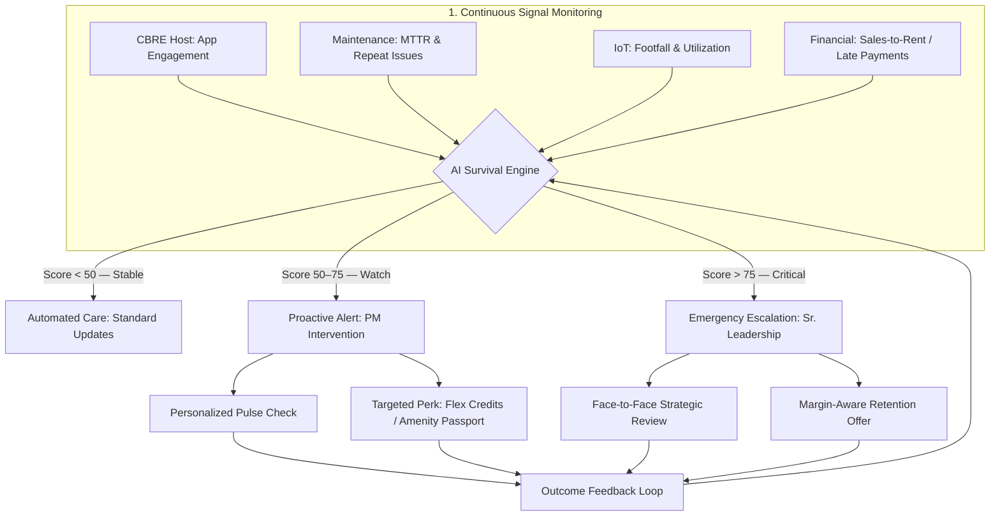

# ChurnGuard AI — Consolidated Research Brief

> **Project:** Agentic system detecting early tenant dissatisfaction signals and triggering proactive retention actions before escalation or revenue loss.

---

## 0. System Design

### Pipeline Architecture (8 Layers + Feedback Loop)

```
1. Data Sources
   - Emails
   - Service Tickets
   - Feedback / Ratings
   - Tenant Metadata (tier, lease info)
        ↓
2. Processing Layer (AI)
   - Sentiment detection
   - Intent extraction (complaint / escalation)
   - Signal structuring
        ↓
3. Pattern Detection
   - Repeat issues
   - Increasing frequency
   - SLA delays
        ↓
4. Context Layer
   - Tenant tier
   - Lease expiry
   - Revenue importance
        ↓
5. Risk Scoring Engine
   - Combines all signals
   - Outputs Tenant Risk Score (Low / Medium / High)
        ↓
6. Decision Engine
   - Monitor (low risk)
   - Notify (medium risk)
   - Act (high risk)
   - [Margin-Aware Offer Library] ← selects lowest-cost intervention for the specific friction type
        ↓
7. Action Layer
   - Alerts
   - Recommended actions
   - Task assignment
        ↓
8. UI / Dashboard
   - Tenant Health Score
   - Risk Drivers
   - Next Best Action
        ↓
9. Outcome Feedback Loop
   - PM logs result: Resolved / Still at Risk
   - Score resets or escalates accordingly
   - Retention Lift tracked as governance KPI
   - Feeds back into Risk Scoring Engine
```

### Tech Stack

| Layer | Technology | Notes |
|---|---|---|
| AI | Azure OpenAI (GPT-4/4.1) + optional Claude/GPT-5.x | Sentiment, intent extraction, Next Best Action generation |
| Backend | Python, FastAPI | Core API and orchestration |
| Decision Engine | Python + lightweight rules config | Multi-signal analysis, pattern detection, context enrichment, dynamic risk scoring, Next Best Action; offer-trigger logic stored in a configurable rules file (not hardcoded) so thresholds can be tuned without redeployment |
| Data Store | PostgreSQL / SQLite | Signal storage, tenant records, score history |
| Integrations | Email ingestion, ticketing APIs, feedback systems | CRM, BMS, Yardi/MRI, occupancy sensors |
| Frontend | React + Material UI | Tenant Health Dashboard |

---

## 1. The Problem (Why This Exists)

**Core dysfunction:** Tenant signals are scattered, detected late, and handled reactively — by the time a move-out notice arrives, dissatisfaction has been simmering for months.

**The silent churn pattern:**
- Tenants stop reporting small issues → they've "given up" and are already looking elsewhere
- 70% of tenant churn is caused by poor *service experiences*, not price
- 85% of churn is attributed to poor communication and lack of personalization
- A **1-point increase in satisfaction** (1–5 scale) → **19.4% lower probability of move-out**

---

## 2. Market Context (2025–2026 Numbers)

| Sector | Vacancy Rate | Churn Driver |
|---|---|---|
| Multifamily (US) | 4.9% by end of 2025 | Newer units with aggressive discounts in Sun Belt (+20% inventory) |
| Office (Global) | Holding ~5.5%; peak 10.7% by 2027/28 (CBRE) | Hybrid work, flight to quality |
| Data Centres | 6.6% (low churn) | AI/cloud demand outpaces supply |

**Key market shifts driving churn:**
- **57%** of occupiers actively downsizing while upgrading space quality
- **75%** of 2025 leasing activity was in green-certified assets (flight to quality)
- **68%** of employees cite *collaboration* as primary reason to come to office
- **85%** of occupiers now expect enhanced amenities
- Retail asking rents up **2.4% YoY** — making service excellence the primary differentiator
- Replacing a commercial tenant costs **up to 3x more** than retaining them

---

## 3. Root Causes of Dissatisfaction (Signal Categories)

### Pillar 1: Operational Friction
- Unaddressed or slow maintenance (HVAC, plumbing, elevators)
- Repeat tickets on same asset → tenant feels ignored
- High emergency-to-preventive work order ratio = stressful, reactive environment

### Pillar 2: Flight to Quality Failure
- Tenants in Grade B/ageing assets churn to premium, green-certified spaces
- Missing: high-speed tech, air quality, ESG certifications, collaborative layouts

### Pillar 3: Poor Communication & Lack of Personalization
- Slow response times, opaque billing, one-size-fits-all management
- "First 100 Days" risk: onboarding failure is a top early-churn trigger
- Tenants who stop complaining are the highest-risk segment

---

## 4. ChurnGuard AI — System Architecture

### How It Works (4 Phases)

**Phase 1 — Predictive Risk Scoring**
- Inputs: CRM logs, maintenance ticket history, building sensor data, financial signals
- Model: Behavioral ML (e.g., Random Forest) flags "quiet tenants"
- Trigger: 20%+ drop in interaction YoY → moved to "Critical Watch"
- Accuracy benchmark: up to 99% churn prediction with right feature set

**Phase 2 — Proactive Sense-and-Respond**
- IoT + predictive maintenance detects HVAC/elevator anomalies with ~85% accuracy
- PM receives automated alert *before* tenant notices failure
- Perception shift: from "neglect" → "care"

**Phase 3 — NLP Sentiment Intervention**
- Scans emails and tickets for frustration keywords: *"again," "unacceptable," "third time," "disappointed"*
- High-emotion cases escalated immediately, bypassing standard queues
- Target: up to 55% reduction in resolution delays

**Phase 4 — Personalized Retention (Generative AI)**
- Low occupancy sensor data → auto-generates "Flex-Plus" proposal (collaborative zone conversion)
- Personalized AI-driven service → 35% higher satisfaction lift vs. reactive fixes

---

## 5. Data Schema — Tenant Survival Score Inputs

### Layer 1: Operational & Service Signals (Friction)

| Data Point | Metric Type | High-Risk Threshold |
|---|---|---|
| Mean Time to Repair (MTTR) | Hours | > 2× the 30-day property average |
| Repeat Ticket Rate | % of total | > 15% reopen rate on same asset |
| SLA Adherence | % resolved on time | < 85% within contractual SLA |
| Emergency Work Order Ratio | Ratio | > 10–15% emergency vs. preventive |

### Layer 2: Behavioral & Sentiment Signals (Engagement)

| Data Point | Source | AI Treatment |
|---|---|---|
| Engagement Delta | Tenant portal / app | Flag >20% drop in logins or bookings |
| Sentiment Score | Emails / support tickets | NLP keyword scoring |
| Amenity Usage | IoT sensors / access logs | Flag low gym, pool, shared space usage |
| Payment History | Accounting / ERP (Yardi/MRI) | Flag frequency of late payments |

### Layer 3: Business Context Signals (Weighting)

| Data Point | Why It Matters | Source |
|---|---|---|
| Lease Stage | Churn peaks in first 100 days and 6 months before expiry | Lease tracking system |
| Asset Quality | Ageing Grade A assets (>10 yrs) face higher vacancy risk | Property classification |
| Occupancy Density | Consistent decline in physical attendance = right-sizing risk | Occupancy sensors |
| Rent vs. Market | Rent >5% above local benchmarks | Market data services |
| Tenant Tier | Enterprise tenants have higher expectations; loss is costlier | CRM / contract data |

---

## 6. Risk Score Bands & Escalation Protocol

### Score Bands

| Score | Status | Action |
|---|---|---|
| 0–30% | Low Risk | Monitor — automated care, standard updates |
| 31–50% | Watch | Automated "Health Check" email; PM adds to weekly review |
| 51–65% (Yellow) | Notify | PM sends personalized "Health Check" via Host App within 24 hrs |
| 66–80% (Orange) | Alert | Sr. PM: personalized call + priority fix within 8 hrs |
| 81–100% (Red) | Escalate | Asset Manager: face-to-face retention meeting within 4 hrs |

### Escalation Workflow (5 Steps)

1. **Ghost Alert** — AI creates a "Shadow Incident" in PM dashboard (bundles evidence: repeat tickets, declining footfall, late payment). No tenant notification yet.
2. **Mobile Push** — CBRE Pulse sends tiered push notification to on-site PM with one-tap "Acknowledge."
   - If not acknowledged within 4 hrs → auto-escalates to Regional Head.
3. **Rescue Workflow** — PM presented with AI-generated "Next Best Action":
   - Pre-populated (editable) outreach email referencing the specific friction
   - "Retention Token" suggestion pushed to tenant's Host App
4. **Human-in-the-Loop Feedback** — PM logs outcome:
   - "Resolved" → AI resets score, monitors 30 days of clean data
   - "Still at Risk" → escalates to Sr. Asset Manager, recommends lease restructure
5. **Post-Intervention Audit** — System tracks "Risk Mitigation Rate" as PM performance KPI
6. **Outcome Feedback Loop** — PM-logged result (Resolved / Still at Risk) is written back to the scoring engine:
   - "Resolved" → score resets; tenant enters 30-day clean-data monitoring window
   - "Still at Risk" → score escalates; case handed to Sr. Asset Manager with lease restructure recommendation
   - Aggregate outcomes feed model retraining and update the **Retention Lift** governance KPI

---

## 7. Sector-Specific Signal Weighting

| Feature Category | Flex Workspace Trigger | Retail Trigger |
|---|---|---|
| Utilization | Drop in desk bookings or Wi-Fi logins | Decline in footfall / dwell time |
| Interaction | Response time to IT/cleanliness tickets | Requests for marketing support or signage |
| Financial | Change in add-on spending (meeting rooms, printing) | Sales-to-rent ratio hitting critical threshold |
| External | Competitor "newer/greener" flex hub opening nearby | Local demographic shifts or anchor tenant departure |

### Flex Workspace
- Integrate with FLAME (Flex License Asset Management Engine) for license renewals
- Use real-time Day Pass / desk booking data from Host app as early signal
- Focus trigger: **"Utilization Decay"** — desk bookings drop while IT support tickets rise → immediate "Success Manager" call
- FlexGrade alignment: if building FlexGrade drops (poor Wi-Fi, dirty common areas) → auto-spike churn risk score

### Retail
- Trigger: Sales-to-Rent misalignment detected → proactive conversation about pop-up format or temporary rent restructure
- Footfall drops below benchmark → suggest marketing support (not rent cut)
- Pulse survey: bi-weekly 1-question automated check; AI scans response speed and tone as risk signal

---

## 8. Micro-Interventions (Margin-Aware Offers)

> **Principle:** Identify the *cheapest* fix for the tenant's *specific* friction point — never default to rent discounts that permanently damage NOI.

| Trigger Signal | Offer Name | Cost to CBRE | Value to Tenant |
|---|---|---|---|
| High maintenance friction / repeat tickets | **VIP Engineer Assignment** — Senior tech lead personally assigned for 30 days | $0 (internal scheduling) | Restores trust via perceived status |
| Declining app / amenity usage (30+ days) | **Amenity Passport** — 10–20 Flex Credits pushed to Host App | Low (unused inventory) | Re-engages with building value |
| Retail sales dip / business stress | **CBRE Network Spotlight** — "Retailer of Month" on lobby screens + tenant app push | $0 (internal media assets) | Free marketing; drives foot traffic |
| Low physical occupancy (badge-in data) | **Team Re-Entry Event** — Tuesday coffee & pastry for their suite | Low (vendor co-sponsor) | Gets staff back; makes office feel alive |
| First 100 Days / new tenant confusion | **Digital Concierge Orientation** — 15-min proactive Host app walkthrough | $0 (staff time) | Prevents early churn; unlocks paid features |
| Tech friction (slow Wi-Fi, IT issues) | **Dedicated IP Upgrade** — 3-month free upgrade | ~$0 (digital config) | Solves frustration immediately |
| Tired / dirty space perception | **Deep-Clean Credit** — One-time specialized cleaning service | Low (vendor rate) | Restores pride in space |

**Implementation logic (pseudocode):**
```
IF Score > 75 AND Issue == 'Maintenance'                               → Trigger Offer_ID: 'VIP_Engineer'
IF Score > 65 AND Engagement_Delta < -20%                              → Trigger Offer_ID: 'Amenity_Passport'
IF Score > 70 AND Sector == 'Retail' AND Sales_Rent_Ratio < threshold  → Trigger Offer_ID: 'Network_Spotlight'
IF Lease_Stage == 'First_100_Days'                                     → Trigger Offer_ID: 'Digital_Concierge'
```

> **Implementation note:** These rules live in a standalone config file (e.g., `offer_rules.yaml`) inside the Decision Engine — not hardcoded in application logic. This allows thresholds and offer mappings to be updated by a product/ops team without touching the codebase.

---

## 9. KPIs & Success Metrics

### Operational KPIs
- **MTTR** — Mean Time to Repair
- **Emergency Work Order Ratio** — target: < 10–15%
- **Repeat Issue Rate** — target: < 15% reopen rate within 30 days
- **SLA Adherence Rate** — target: > 85%

### Behavioral / AI KPIs
- **Digital Engagement Index** — portal logins, app usage, amenity bookings
- **Interaction Frequency Delta** — 20% drop = Critical Watch
- **Sentiment Score** — NLP frustration keyword frequency

### Business KPIs
- **Renewal Probability Index** — weighted vacancy cost vs. renewal cost
- **NPS / Tenant Satisfaction Score (TSS)** — 1-point increase = 19.4% lower move-out probability
- **Occupancy Density** — consistent decline = right-sizing risk flag

### AI Governance KPIs
- **Incident Detection Rate** — how early AI flags at-risk tenants vs. actual move-out notice
- **Human Override Rate** — high rate = model needs retraining
- **Retention Lift** — YoY improvement for tenants flagged and "saved"
- **Offer Acceptance Rate** — did Margin-Aware Offers lead to score improvement?
- **Risk Mitigation Rate** — PM performance KPI; % of high-risk tenants moved back to low-risk

### 2026 Benchmarks
| Metric | Industry Average | High-Performer Target |
|---|---|---|
| Retention Rate | ~48% | 60–70% |
| Acknowledgement SLA | — | Within hours |
| Issue Resolution | — | 24–48 hours |
| Economic Occupancy | — | 99% (e.g., Heimstaden Bostad) |

---

## 10. Financial Case (ROI Summary)

### Per 1,000 sq. ft. Unit: Churn vs. Survival Protocol

| Cost of Churn (Vacancy) | Cost of Survival Protocol |
|---|---|
| Rent loss (3 months): **$25,000** | AI subscription/data fee: **$50** |
| Brokerage commission: **$8,000** | Proactive perk (amenity/VIP): **$450** |
| Refurbishment/cleaning: **$5,000** | Staff allocation time: **$200** |
| Marketing/listing: **$2,000** | — |
| **TOTAL LOSS: $40,000** | **TOTAL INVESTMENT: $700** |

**ROI Ratio: 57:1** — for every $1 spent on the protocol, $57 of revenue is protected.

### Cap Rate / Asset Valuation Argument
- **Rent discount of $5,000/year** at 5% Cap Rate = **$100,000 reduction in building sale value** (permanent)
- **Amenity Bundle perk** = OpEx, not rent reduction → Face Rent stays at 100% → building valuation protected
- Behavioral AI identifies dissatisfaction **3.5 months before** lease expiry on average

### Broader Impact Targets
| Metric | Expected Impact |
|---|---|
| Churn rate reduction | 40% for high-frequency leasing portfolios |
| Profit margin increase | 25% via non-discount retention |
| Emergency repair cost reduction | 30% via Predictive IoT |
| Satisfaction-driven retention | +19.4% move-out probability reduction per 1-pt score gain |
| Satisfaction score lift | 35% higher with proactive vs. reactive fixes |

---

## 11. System Flow Diagram



---

## 12. Data Integration Requirements

| Data Source | What It Feeds | Platform |
|---|---|---|
| CRM (Salesforce / MS Dynamics) | Tenant communication history, interaction frequency | CRM Sync |
| Building Management System (BMS) | HVAC health, elevator uptime, IoT sensor data | IoT Bridge |
| Accounting Suite (Yardi / MRI) | Late payment frequency, financial distress signals | Financial Sync |
| Tenant App (CBRE Host) | Engagement delta, amenity usage, survey responses | Host API |
| Lease Tracking System | Lease stage, days to expiry, renewal probability | EDP Integration |
| Occupancy Sensors | Badge-in data, physical density trends | IoT Bridge |
| Market Data Services | Rent vs. local benchmark, competitor activity | Market Feed |

---

## 13. Implementation Roadmap (6-Month Pilot)

| Month | Milestone |
|---|---|
| 1 | Integrate CBRE Host engagement data and Pulse maintenance logs |
| 2 | Establish AI risk scoring baseline for high-velocity units |
| 3–5 | Trigger Margin-Aware Offers on scores > 70; log outcomes |
| 6 | Performance audit: Retention Lift vs. control group |

**Pilot design:**
- Select a high-vacancy beta market (US Office Hub or Sun Belt Multifamily cluster)
- Control group: AI-managed buildings vs. traditionally managed buildings over 6 months

**Change management:**
- "Why" briefing for PMs: protocol reduces emergency fires, not adds work
- Incentive alignment: link PM bonuses to Risk Mitigation Rate (not just current occupancy)
- Introduce **Portfolio Health Index (PHI)** = average Survival Score across all tenants in a building; target PHI > 80%

---

## 14. Dashboard Design

### Layout Overview

```
┌─────────────────────────────────────────────────────────────────┐
│  TOP BAR                                                        │
│  [ Escalate ▲ ]  ← sends alert to Account Manager / Team       │
│  Auto-triggers when score breaches threshold (no manual step)   │
├──────────────────────────┬──────────────────────────────────────┤
│  LEFT PANEL              │  RIGHT PANEL                        │
│                          │                                      │
│  Tenant Health List      │  Selected Tenant Detail             │
│  ● Green  (Low Risk)     │  ├─ Risk Score + Band               │
│  ● Yellow (Watch)        │  ├─ Lease Countdown (days to expiry)│
│  ● Red    (High Risk)    │  ├─ Sentiment Trend Chart           │
│                          │  └─ Issue Frequency Chart           │
├──────────────────────────┴──────────────────────────────────────┤
│  MIDDLE — Agent Reasoning Panel                                 │
│  "Score increased from 48 → 74 because:                        │
│   • 3 repeat HVAC tickets in 14 days (+18 pts)                 │
│   • App engagement dropped 22% this month (+12 pts)            │
│   • Lease expiry in 87 days (+8 pts)"                          │
│  Recommended Action: [Send Amenity Passport Offer]             │
├─────────────────────────────────────────────────────────────────┤
│  BOTTOM — Recent Interactions (Top 5)                          │
│  [Tenant]  [Type]     [Date]   [Sentiment]  [Status]           │
│  Acme Co   Email      May 4    Frustrated   Unresolved         │
│  TechFlow  Ticket     May 3    Neutral      Resolved           │
│  ...                                                            │
└─────────────────────────────────────────────────────────────────┘
```

### Core Features (Must Have)

**Tenant Health List (Left Panel)**
- Colour-coded rows: Green (0–30) / Yellow (31–65) / Red (66–100)
- Sortable by risk score, lease expiry, tenant tier
- One-click to load full tenant detail in right panel

**Tenant Detail (Right Panel)**
- Risk score badge with band label (Monitor / Watch / Notify / Escalate)
- Lease countdown — days remaining, highlighted red if < 90 days
- Sentiment trend chart — NLP score over last 30/60/90 days
- Issue frequency chart — ticket volume and repeat rate over time

---

### Nice-to-Have Features

**Top — Escalate Button**
- Visible at all times; pre-populates an alert with the current tenant's score, risk drivers, and recommended action
- Sends to the assigned Account Manager / team channel (email or Slack/Teams integration)
- Also fires **automatically** when a score crosses a configured threshold (e.g., crosses into Red band) — no manual step required
- Alert body includes: tenant name, score, top 3 signal drivers, suggested Margin-Aware Offer

**Middle — Agent Decisions with Reasoning**
- Explains *why* the score moved, not just what the score is
- Shows each contributing signal with its point weight (e.g., "Repeat ticket +18 pts, Engagement drop +12 pts, Lease proximity +8 pts")
- Displays the selected Next Best Action with a one-click "Send Offer" or "Assign Task" button
- Reasoning is generated by the LLM layer (Azure OpenAI) and stored per-scoring-event for audit trail

**Bottom — Recent Interactions Summary (Top 5)**

| Tenant | Type | Date | Sentiment | Status |
|---|---|---|---|---|
| Acme Corp | Email | May 4 | Frustrated | Unresolved |
| TechFlow | Support Ticket | May 3 | Neutral | Resolved |
| RetailCo | Feedback Form | May 1 | Negative | Escalated |
| StartupX | Email | Apr 30 | Positive | Closed |
| GlobalInc | Ticket | Apr 29 | Frustrated | In Progress |

- Clicking any row opens the full interaction detail and links to the tenant's risk profile
- Sentiment column driven by NLP scoring; Status pulled from ticketing system in real time

---

### Component → Data Source Mapping

| UI Component | Data Source | Backend Endpoint |
|---|---|---|
| Health List + Score | Risk Scoring Engine | `GET /tenants/scores` |
| Lease Countdown | Lease Tracking System | `GET /tenants/{id}/lease` |
| Sentiment Chart | NLP Processing Layer | `GET /tenants/{id}/sentiment` |
| Issue Frequency Chart | Maintenance / Ticketing API | `GET /tenants/{id}/tickets` |
| Agent Reasoning Panel | LLM output (Azure OpenAI) | `GET /tenants/{id}/reasoning` |
| Escalate Button | Alert Service | `POST /alerts/escalate` |
| Recent Interactions | CRM + Ticketing + Email | `GET /tenants/{id}/interactions` |
| PHI Summary Bar | Risk Scoring Engine | `GET /portfolio/phi` |
| Score Velocity Indicator | Risk Scoring Engine (delta) | `GET /tenants/{id}/score-history` |
| Offer History Tab | Decision Engine / Action Log | `GET /tenants/{id}/offers` |

---

### Dashboard Improvements

#### High Value, Low Effort

**Portfolio Health Index (PHI) Summary Bar**
- Persistent bar at the very top of the dashboard showing the average Survival Score across all tenants in the current building/portfolio view
- Gives managers a portfolio-level pulse before drilling into individual tenants
- Colour-coded: Green (PHI > 80) / Amber (60–80) / Red (< 60)
- PHI is already defined in the system design (Section 13); this just surfaces it in the UI

**"Last Scored" Timestamp**
- Displayed next to each tenant row in the health list
- A Red score from 5 minutes ago vs. 3 days ago carries very different urgency — without this, PMs can't tell
- Tooltip on hover shows full scoring event details

**Lease Proximity Filter**
- One-click filter on the health list for tenants with lease expiry < 90 days
- Prevents the most time-sensitive tenants from being buried in a long list
- Pairs with the existing sort-by-expiry option for deeper triage

---

#### Medium Value, Medium Effort

**Score Velocity Indicator**
- Directional arrow (↑ ↓ →) displayed next to the score badge in the tenant detail panel
- Based on 7-day delta: rising / falling / stable
- *The highest-impact single addition* — a score of 68 trending down is very different from 68 trending up; reframes every score from a static number into an actionable signal
- Backend: compare current score against score 7 days prior from `score-history`

**Offer History Tab**
- Tab inside the tenant detail panel listing all previously sent Margin-Aware Offers
- Columns: Offer Name, Date Sent, Accepted (Y/N), Score Before, Score After
- Prevents PMs from repeating a failed intervention and gives visible proof of AI-driven retention
- Feeds the "Offer Acceptance Rate" governance KPI (Section 9)

**NPS / Satisfaction Score Overlay on Sentiment Chart**
- Plots the survey-based NPS/TSS score on the same axis as the NLP sentiment trend
- Divergence between the two (e.g., NPS looks fine but NLP is frustrated) is itself a churn signal worth flagging with an annotation
- Requires NPS data from the feedback system to be piped into the same chart endpoint

---

#### Nice to Have, Higher Effort

**Score Comparison Mode**
- Select two tenants side by side for parallel detail view
- Useful for asset managers reviewing a building's at-risk cohort rather than individual cases

**"Saved by AI" Counter**
- Small stat on the dashboard header: number of tenants moved from Red/Orange back to Green this quarter
- Builds PM trust in the system and gives leadership a visible ROI number without pulling a separate report
- Feeds directly from Outcome Feedback Loop data (Section 6, Step 6)

---

## 15. Legal & Privacy Guardrails

- **Anonymization:** NLP sentiment analysis used for pattern detection, not individual surveillance
- **GDPR/Local Privacy Compliance:** verify occupancy sensor data collection aligns with lease clauses and applicable regulations
- **Data Minimization:** collect only signals necessary for risk scoring; no personal conversation content stored raw

---

## 15. One-Line Pitches by Audience

| Audience | Pitch |
|---|---|
| Property Manager | "This reduces your emergency fires and high-stress move-outs — it's your early warning system." |
| Finance Director | "By spending $700 on proactive intervention today, we prevent a $40,000 vacancy loss tomorrow." |
| Asset Manager | "We protect Face Rent and building valuation by solving problems before tenants ask for discounts." |
| CBRE Leadership | "This moves us from reactive issue handling to revenue-protecting risk orchestration across our highest-velocity sectors." |
